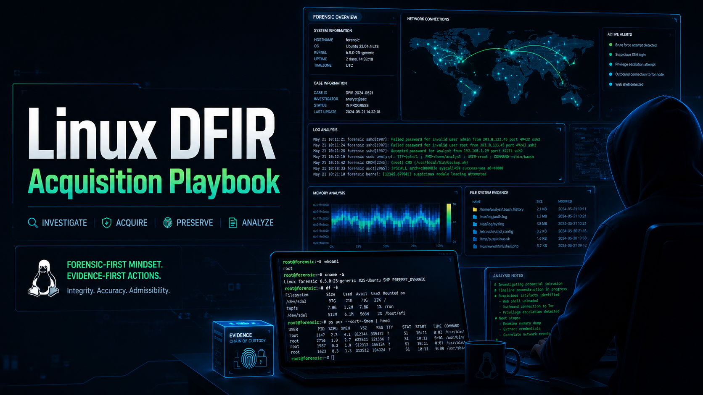

<h1 align="center">Linux DFIR Acquisition Playbook</h1>

  <b>Linux forensic acquisition workflow for incident response and evidence collection</b>

  

---

## 📌 Overview

When a Linux server is suspected to be compromised, every second matters. Attackers may be actively running processes, maintaining persistence, or exfiltrating data.

This playbook provides a **clear and actionable approach** to collecting forensic evidence from a live Linux system without disrupting critical artifacts. It focuses on **prioritizing volatile data**, **understanding attacker behavior**, and ensuring that **evidence is preserved in a forensically sound manner**.

Rather than listing generic commands, this guide helps you **think like an investigator**—what to collect first, what matters most, and how attackers typically leave traces on Linux systems.

---

## 🎯 Objectives

This playbook is designed to help you:

- Capture **live system activity** before it disappears
- Identify **malicious processes and connections**
- Collect **reliable logs and traces of attacker actions**
- Detect **persistence techniques** used on Linux
- Safely **acquire disk and memory** for deeper analysis
- Build a **timeline of events** during the incident

---

## 📚 Table of Contents

1. [Live System Snapshot (First Response)](01-live-system-snapshot.md)
2. [Memory Acquisition](02-memory-acquisition.md)
3. [Disk Acquisition](03-disk-acquisition.md)
4. [Log Collection & Analysis](04-log-collection-and-analysis.md)
5. [Persistence Investigation](05-persistence-investigation.md)
6. [User-Level Artifacts](06-user-level-artifacts.md)
7. [Network State & Indicators]()
8. [File System & Timeline Analysis]()
9. [Rootkit & Integrity Checks]()

---

## 🪟 Related Project

Windows DFIR acquisition workflow for incident response and evidence collection:

🔗 https://github.com/ilyess-sellami/DFIR-Windows-Acquisition-Playbook
